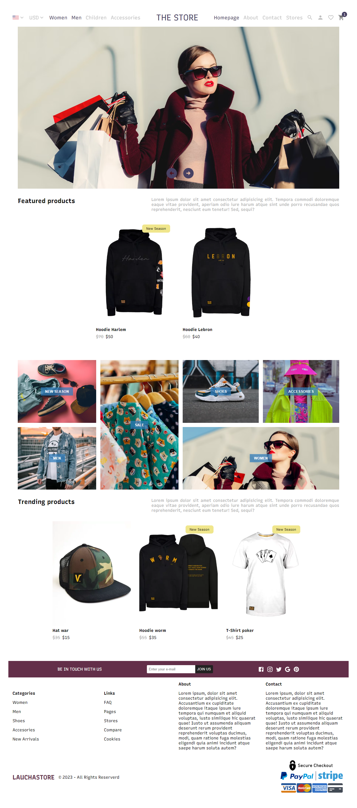
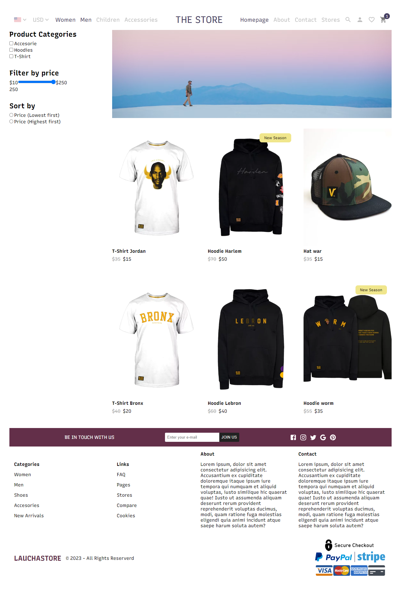
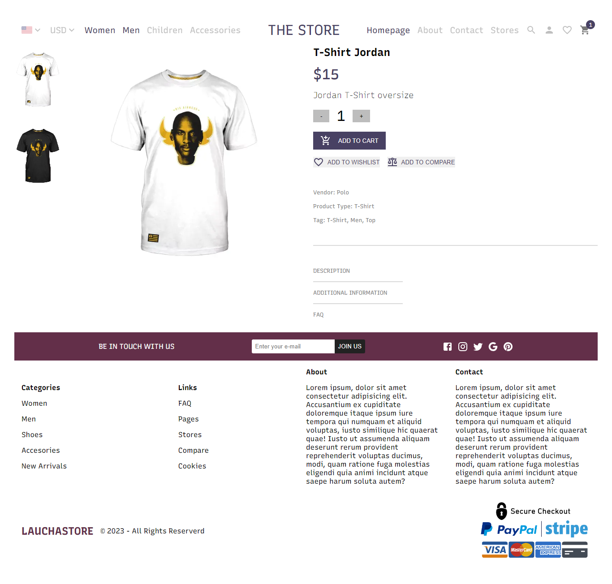

# E-commerce-React-Strapi

### - Made with
### - React (Vite) with Typescript.
### - Redux for the cart. 
### - Stripe for the API products. 
### - Css modules for the styles.

# E-commerce-React-Strapi

## Table of contents

- [Overview](#overview)
  - [The challenge](#the-challenge)
- [My process](#my-process)
  - [Built with](#built-with)
- [Author](#author)

## Overview

### The challenge

Your users should be able to:

•Browse the web, see different categories of products, filter by price, type of product and order by price, add products to the cart, and see it.
•Responsive website.

## My process

### Built with

- React (VITE)
- TypeScript
- CSS modules
- Strapi (Products data)
- Redux (Manage data when we add it to the cart)

## Author

- Website - [Lautaro Espinillo](https://thelaucha.github.io/lautaro_espinillo_portfolio/)
